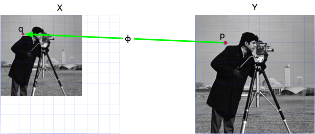

# ImageTransformations.jl

```@setup overview
using ImageShow
```

This package provides support for image resizing, image rotation, and
other spatial transformations of arrays.

## Overview

ImageTransformations.jl consists of two sets of API: the low level warping operations, and the high-level operations that built on top of it.

- Low-level warping API:
  - `warp`: backward-mode warping
  - `WarpedView`: the lazy view version of `warp`
  - `InvWarpedView`: the inverse of `WarpedView`
- high-level spatial operations:
  - `imresize`: aspect adjustment
  - `restrict`: a much more efficient version of `imresize` that two-folds/down-samples image to approximate 1/2 size. (This is now provided by ImageBase.)
  - `imrotate`: rotation

For detailed usage of these functions, please refer to [function references](@ref package_references) and [examples](@ref Examples). The following section explains
the core concept image warping so that you can get a clear understanding about
this package while using it.

## [Image warping](@id index_image_warping)

!!! info
    This is just a very simple explaination on the internal of ImageTransformations. For more information about image warping, you can take a look at [the Princeton Computer Graphics course for Image Warping (Fall 2000)](https://www.cs.princeton.edu/courses/archive/fall00/cs426/lectures/warp/warp.pdf)

Most image spatial transformation operations (e.g., rotation, resizing, translation) fall into the category of warping operation. Mathematically, for given input image `X`, a (backward-mode) warping operation `f` consists of two functions: coordination map `ϕ` and intensity estimator `τ`.

```math
Y_{i,j} = f(X)_{i, j} = τ(X, ϕ(i, j))
```

Take the following resizing operation as an example, for every pixel position `p` in output image `Y`, we 1) use the backward coordinate map `ϕ` to get its corresponding pixel position `q` in original image `X`. Since `q` may not be on grid, we need to 2) estimate the value of `X` on position `q` using function `τ`, and finally 3) assign `X[q]` back to `Y[p]`. In Julia words, it is

```julia
for p in CartesianIndices(Y)
    q = ϕ(p) # backward coordinate map
    v = τ(X, q) # estimate the value
    Y[p] = v # assign value back
end
```

As you may have notice, we use backward coordinate map because this is the simplest way to iterate every pixel of the output image. This is why it is called backward-mode warping. In some literature, it is also called reverse warping.



In ImageTransformations, the `warp`-based operation uses Interpolations as our intensity estimator `τ`:

```@example overview
using Interpolations, ImageCore, TestImages
using ImageTransformations

X = imresize(testimage("cameraman"), (64, 64)) # use small image as an example

sz = (128, 128)
Y = similar(X, sz...)

# intensity estimator using interpolation
itp = interpolate(X, BSpline(Linear())) # bilinear interpolation
τ(q) = itp(q...)

# A linear coordinate map that satisfies:
#   - `ϕ(1, 1) == (1, 1)`
#   - `ϕ(128, 128) == (64, 64)`
K = (size(X) .- (1, 1))./(sz .- (1, 1))
b = (1, 1) .- K
ϕ(p) = @. K*p + b

for p in CartesianIndices(Y)
    q = ϕ(p.I)
    Y[p] = τ(q)
end

mosaic(X, Y; nrow=1)
```

This is the internal of ImageTransformations. For common usage of ImageTransformations, you should use either the low-level API `warp` or
high-level API `imresize` and others.
